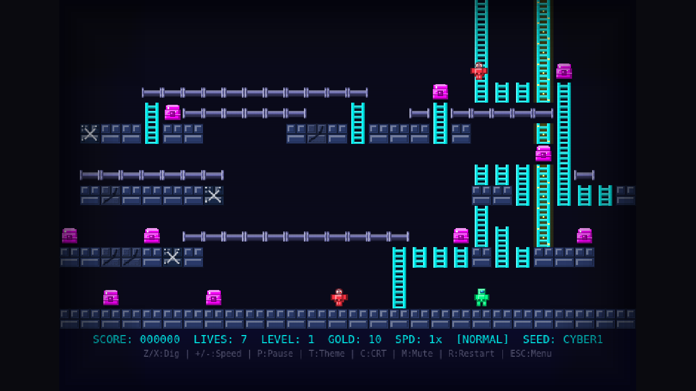
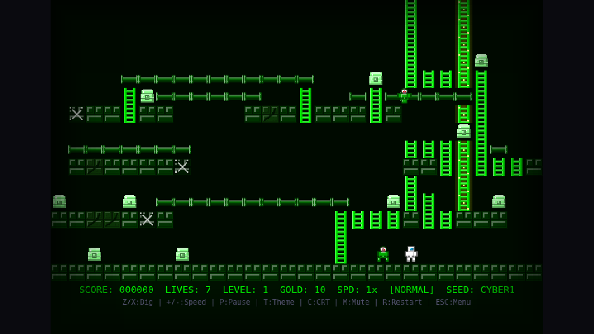

# Lode Runner 2099

[](https://loderunner2099.exe.xyz/)
[](LICENSE)

A modern web-based reimagining of the classic Lode Runner game with procedural level generation, multiple themes, and shareable seeds.



## ✨ Features

- **Procedural Level Generation** - Infinite unique levels generated from shareable seed codes
- **4 Difficulty Levels** - Easy, Normal, Hard, and Ninja with scaling complexity
- **5 Visual Themes** - Cyber Blue, Matrix, Sunset Chrome, Neon Noir, and Classic C64
- **Seed Sharing** - Share specific levels with friends via URL or seed code
- **Adjustable Speed** - 6 speed settings from 0.5x to 2x
- **CRT Filter** - Optional retro scanline effect
- **Sound Effects** - Retro-style audio with mute option
- **Responsive Controls** - Keyboard support with on-screen hints

## 🎮 How to Play

### Controls

| Key | Action |
|-----|--------|
| Arrow Keys | Move |
| Z | Dig Left |
| X | Dig Right |
| +/- | Adjust Speed |
| P | Pause |
| T | Change Theme |
| C | Toggle CRT Effect |
| M | Mute/Unmute |
| R | Restart Level |
| ESC | Return to Menu (double-tap) |

### Objective

Collect all the gold on each level, then climb to the top to escape. Avoid or trap enemies by digging holes in the brick floor. Enemies caught in holes will be stunned and drop any gold they're carrying.

## 🚀 Quick Start

### Play Online

Visit **[loderunner2099.exe.xyz](https://loderunner2099.exe.xyz/)** to play instantly!

### Local Development

```bash
# Clone the repository
git clone https://github.com/jgbrwn/loderunner2099.git
cd loderunner2099

# Install dependencies
npm install

# Start development server
npm run dev
```

Then open http://localhost:5173 in your browser.

### Production Build

```bash
npm run build
```

The built files will be in the `dist/` directory.

For production deployment with optimal caching, see [DEPLOYMENT.md](DEPLOYMENT.md).

## 🛠️ Tech Stack

- **Game Engine**: [Phaser 3](https://phaser.io/) - HTML5 game framework
- **Language**: TypeScript
- **Build Tool**: [Vite](https://vitejs.dev/) - Fast development and optimized builds
- **Production Server**: Go with optimized caching headers
- **Process Manager**: systemd (for Linux deployment)

## 📁 Project Structure

```
loderunner2099/
├── src/
│   ├── main.ts              # Entry point
│   ├── config.ts            # Game configuration
│   ├── scenes/
│   │   ├── MenuScene.ts     # Main menu
│   │   └── GameScene.ts     # Core gameplay
│   ├── entities/
│   │   ├── Player.ts        # Player character
│   │   └── Enemy.ts         # Enemy AI
│   ├── level/
│   │   ├── LevelGenerator.ts    # Procedural generation
│   │   ├── TileMap.ts           # Level data structure
│   │   └── SolvabilityChecker.ts # Level validation
│   └── utils/
│       ├── SeededRandom.ts  # Deterministic RNG
│       └── SoundManager.ts  # Audio handling
├── public/                  # Static assets
├── dist/                    # Production build output
├── server/                  # Go production server (after build)
└── docs/screenshots/        # Documentation images
```

## 🎨 Themes

| Theme | Description |
|-------|-------------|
| **Cyber Blue** | Default neon cyberpunk aesthetic |
| **Matrix** | Green-on-black digital rain style |
| **Sunset Chrome** | Warm orange and purple tones |
| **Neon Noir** | High contrast black with neon accents |
| **Classic C64** | Authentic Commodore 64 color palette |



## 🎯 Difficulty Levels

| Difficulty | Complexity | Ladders | Enemies | Gold | Speed |
|------------|------------|---------|---------|------|-------|
| Easy | Low | Many | 1-2 | 5-8 | 0.7x |
| Normal | Medium | Moderate | 2-3 | 8-12 | 1.0x |
| Hard | High | Few | 3-4 | 12-16 | 1.2x |
| Ninja | Maximum | Sparse | 4-5 | 16-20 | 1.4x |

## 🔗 Sharing Levels

Share a specific level by copying the URL with seed and difficulty parameters:

```
https://loderunner2099.exe.xyz/?seed=CYBER1&diff=normal
```

Or type a seed code directly in the menu and share it with friends!

## 📜 License

This project is licensed under the MIT License - see the [LICENSE](LICENSE) file for details.

## 🙏 Acknowledgments

- Original Lode Runner by Douglas E. Smith (1983)
- Inspired by the C64 version and various ports
- Built with [Phaser 3](https://phaser.io/)
